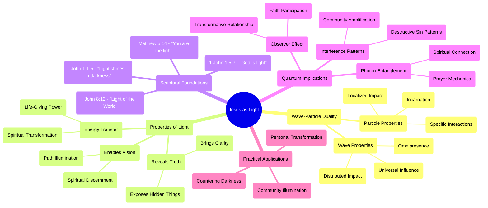

# Jesus as Light - Mind Map

```mermaid
mindmap
  root((Jesus as Light))
    (Wave-Particle Duality)
      (Wave Properties)
        (Omnipresence)
        (Universal Influence)
        (Distributed Impact)
      (Particle Properties)
        (Incarnation)
        (Specific Interactions)
        (Localized Impact)
    (Properties of Light)
      (Reveals Truth)
        (Exposes Hidden Things)
        (Brings Clarity)
      (Enables Vision)
        (Spiritual Discernment)
        (Path Illumination)
      (Energy Transfer)
        (Spiritual Transformation)
        (Life-Giving Power)
    (Scriptural Foundations)
      (John 8:12 - "Light of the World")
      (John 1:1-5 - "Light shines in darkness")
      (Matthew 5:14 - "You are the light")
      (1 John 1:5-7 - "God is light")
    (Quantum Implications)
      (Observer Effect)
        (Faith Participation)
        (Transformative Relationship)
      (Interference Patterns)
        (Community Amplification)
        (Destructive Sin Patterns)
      (Photon Entanglement)
        (Spiritual Connection)
        (Prayer Mechanics)
    (Practical Applications)
      (Personal Transformation)
      (Community Illumination)
      (Countering Darkness)
```
