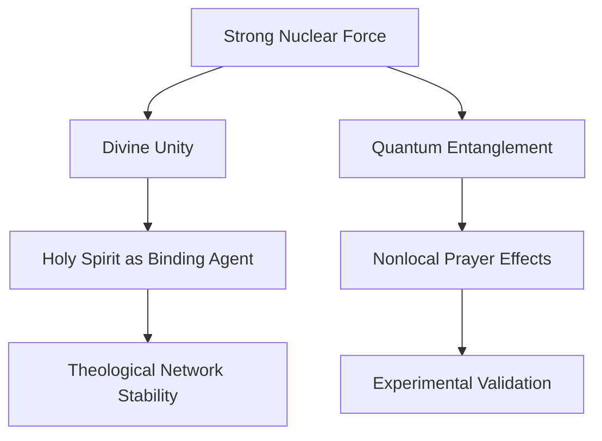

---
meta_tags:
- transition
- entanglement
- sin
- law
- notes
- light
- framework
- truth
- network
- experiment
- energy
- phase
- unity
- vine
- quantum
- community
summary: '# Law 2: Comprehensive Keyword & Concept Map ## 📜 Connection-Generating
  Framework for Law 2 ### 🔗 Concept Bridge for Law 2: The Bond That Can''t Be Broken
  #### Core Connection - **Physical Principle**: The **Strong Nuclear Force** binds
  protons and neutrons together, overcoming their natural repulsion.'
---

# Law 2: Comprehensive Keyword & Concept Map

##  Connection-Generating Framework for Law 2

###  Concept Bridge for Law 2: The Bond That Can't Be Broken

#### Core Connection
- **Physical Principle**: The **Strong Nuclear Force** binds protons and neutrons together, overcoming their natural repulsion.
- **Spiritual Parallel**: **Divine Unity & Covenant** binds individuals and communities, overcoming division and entropy.
- **Mathematical Expression**: \\( V(r) = -g^2\\frac{e^{-m r}}{r} \\) (Yukawa potential) representing the binding force intensity over distance.

#### Connection Strength
- **Direct Evidence**: The fine-tuning of nuclear force allows stable atomic structures, mirroring the stabilizing role of faith-based unity.
- **Inferential Evidence**: Quantum entanglement demonstrates nonlocal connectivity, reflecting spiritual interconnectedness.
- **Predictive Power**: If theological unity follows nuclear binding patterns, **doctrinal cohesion models** could predict faith-community resilience.

#### Bidirectional Insights
- **Physics → Spirituality**: The **gluon exchange mechanism** in nuclear force parallels the **Holy Spirit's role** in maintaining spiritual bonds.
- **Spirituality → Physics**: Theological unity models could inform **network science stability algorithms** based on divine covenants.

#### Related Laws
- Primary: **[[Law 2: The Bond That Can't Be Broken]]**
- Secondary: **[[Law 1: Gravity & Sin]], [[Law 3: Light & Truth]], [[Law 5: Entropy & Free Will]]**

#### Open Questions
- Does **synchronized prayer induce nonlocal EEG coherence** similar to quantum entanglement?
- Can **theological networks be mathematically modeled** using nuclear binding energy equations?

#### Research Directions
- **Quantum Prayer EEG Study**: Measuring phase synchronization in remote intercessory prayer.
- **Faith-Based Network Analysis**: Applying **graph theory** to measure doctrinal cohesion vs. fragmentation.

---

###  Cross-Disciplinary Analysis for Law 2

#### Disciplinary Perspectives
- **Physics**: Quantum Chromodynamics (QCD), nuclear force, entanglement.
- **Theology**: Divine unity, covenant, Trinitarian interconnectivity.
- **Philosophy**: The metaphysics of unity vs. separation.
- **Mathematics**: Graph theory, network stability, Yukawa potential.

#### Harmony Analysis
- **Areas of Agreement**: Both nuclear and theological unity require a force stronger than individual repulsion to sustain structure.
- **Apparent Contradictions**: The nuclear force is **strictly local**, while spiritual unity claims **nonlocal coherence**.
- **Synthesis Opportunities**: Investigating **quantum coherence models** for prayer and faith community dynamics.

#### Dimensional Analysis
- **Physical Dimension**: Strong nuclear force governs subatomic cohesion.
- **Informational Dimension**: Faith and doctrine as **low-entropy information structures**.
- **Consciousness Dimension**: Quantum entanglement-like effects in group spiritual practices.
- **Spiritual Dimension**: The Holy Spirit as the **binding agent** of divine unity.

#### Integration Model
- **Proposed Framework**: Theological unity follows nuclear force models at social and metaphysical levels.
- **Mathematical Model**: Applying entropy equations to faith-community structures.
- **Testable Elements**: EEG coherence, HRV in group worship, doctrinal stability over time.

#### Connected Concepts
- [[Quantum Faith Entanglement]]
- [[Theological Stability Metrics]]
- [[Entropy & Spiritual Cohesion]]

---

###  Radical Hypothesis for Law 2

#### The Wild Idea
- **The strong nuclear force is a lower-order manifestation of divine unity, which scales fractally across dimensions.**

#### Conventional Understanding
- The **strong nuclear force** is purely physical and confined to subatomic interactions.

#### The Paradigm Shift
- If **spiritual unity follows the same laws**, it suggests that nuclear binding **and** theological unity emerge from a common underlying structure.

#### Potential Implications
- **For Physics**: Could lead to a **spiritually-informed quantum gravity model**.
- **For Theology**: Suggests that divine unity is **scientifically describable**.
- **For Consciousness**: Supports the **quantum theory of mind and prayer-based synchronization**.
- **For Humanity**: Could provide a **predictive model for social cohesion and division.**

#### Supporting Patterns
- [[Quantum Entanglement & Prayer Synchronization]]
- [[Theological Network Resilience]]
- [[Sacred Information Entropy]]

#### Thought Experiments
- Can **HRV and EEG phase locking** reveal theological entanglement?
- Do faith communities **with doctrinal cohesion** exhibit **higher statistical resilience** in crises?

#### Integration with Laws
- [[Law 1: Gravity & Sin]] → Binding force prevents disintegration, mirroring gravity's role in physical cohesion.
- [[Law 3: Light & Truth]] → Spiritual unity functions like **light coherence (laser vs. scattered photons).**
- [[Law 5: Entropy & Free Will]] → Sin increases **spiritual entropy**, breaking theological bonds.

---

##  Tag System for Law 2 Research Files

- `#quantum` - Quantum Entanglement, Coherence, Nonlocality.
- `#nuclear` - Strong Force, Binding Energy, Gluon Dynamics.
- `#faith-unity` - Divine Covenant, Theological Cohesion, Church Stability.
- `#entropy` - Information Theory, Chaos vs. Order in Theology.
- `#consciousness` - EEG/HRV in Prayer, Quantum Mind Hypothesis.
- `#experiment` - Testable Predictions (EEG Prayer Sync, HRV Heart-Brain Coherence).
- `#network-theory` - Graph Analysis of Religious Movements.
- `#direct-parallel` - Strong Nuclear Force ↔ Divine Unity.
- `#creative-leap` - Quantum Physics ↔ Theological Stability Model.

---

##  Connection Tracking System for Law 2

### Physics → Spirituality Connections

| Physics Concept | Spiritual Concept | Connection Strength | Primary Law | Notes |
|-----------------|-------------------|---------------------|-------------|-------|
| Strong Nuclear Force | Divine Unity & Covenant | Strong | [[1 Faith with Physics/Law 2 Folder/Law 2/Law 2 Meta]] | Nuclear cohesion = faith cohesion |
| Quantum Entanglement | Synchronized Prayer | Medium | [[1 Faith with Physics/Law 2 Folder/Law 2/Law 2 Meta]], [[1 Faith with Physics/10_Laws/Law_08_Quantum_FreeWill/Law 3 Light]] | EEG evidence of coherence |
| Information Entropy | Theological Structure | Strong | [[1 Faith with Physics/10_Laws/Law_08_Quantum_FreeWill/Law 5]] | Low-entropy doctrine = stability |

### Spirituality → Physics Insights

| Spiritual Concept | Physics Insight | Validation Status | Primary Law | Notes |
|-------------------|-----------------|-------------------|-------------|-------|
| Holy Spirit as Binding Force | Gluons as Binding Particles | Hypothetical | [[1 Faith with Physics/Law 2 Folder/Law 2/Law 2 Meta]] | Spiritual parallel to QCD |
| Sin as Division | Entropy Increase in Systems | Testable | [[1 Faith with Physics/10_Laws/Law_08_Quantum_FreeWill/Law 5]] | Sin increases disorder |
| Faith as Coherence | Quantum Coherence | Emerging | [[1 Faith with Physics/10_Laws/Law_08_Quantum_FreeWill/Law 3 Light]] | Potential EEG coherence evidence |

---

##  Visualization Framework

### Concept Network for Law 2

---

## Integration with Law 1: Gravity & Sin

### Connection Points between Law 1 and Law 2

| Law 1 Concept | Law 2 Concept | Integration Insight |
|---------------|---------------|---------------------|
| Gravity | Strong Nuclear Force | Both are fundamental forces with different ranges and strengths |
| Sin & Fallen Nature | Division & Separation | Both represent forces that pull apart what should be united |
| Escape Velocity | Binding Energy | Both represent thresholds that must be overcome |
| Black Hole Event Horizon | Nuclear Stability Threshold | Both represent points of no return in their respective systems |
| Spiritual Propulsion | Holy Spirit as Binding Agent | Both provide the energy needed to overcome negative forces |

### Unified Framework

The integration of Law 1 (Gravity & Sin) and Law 2 (Nuclear Force & Unity) suggests a comprehensive model of spiritual forces:

1. **Downward Pull**: Gravity/Sin exerts a constant downward force on consciousness
2. **Binding Force**: Nuclear Force/Holy Spirit creates cohesion against this pull
3. **Energy Threshold**: Overcoming sin requires spiritual energy analogous to escape velocity
4. **Stability Zones**: Communities with strong binding force can resist gravitational collapse

This integration reveals that spiritual progress requires both:
- Sufficient upward propulsion (Law 1 - overcoming gravity/sin)
- Strong lateral bonds (Law 2 - nuclear force/community)

### Research Questions for Integrated Study

1. Do spiritual communities with strong internal bonds (Law 2) show greater resilience against moral decline (Law 1)?
2. Can the mathematical relationship between gravitational force and nuclear binding force inform our understanding of the relationship between sin and divine unity?
3. Is there a quantifiable "spiritual phase transition" where binding energy overcomes gravitational pull?