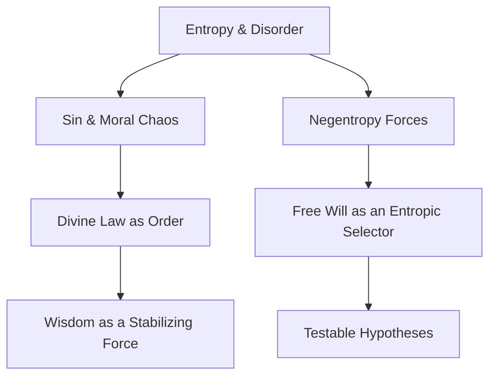

---
meta_tags:
- sin
- law
- grace
- notes
- light
- framework
- truth
- choice
- experiment
- network
- energy
- training
- vine
summary: '# **Law 5: Comprehensive Keyword & Concept Map** ## **📜 Connection-Generating
  Framework for Law 5** ### **🔗 Concept Bridge for Law 5: Entropy, Free Will, and
  Divine Order** **Core Connection:** - **Physical Principle**: **The Second Law of
  Thermodynamics** states that entropy (disorder) always increases in an isolated
  system.'
---

# **Law 5: Comprehensive Keyword & Concept Map**

## ** Connection-Generating Framework for Law 5**

### ** Concept Bridge for Law 5: Entropy, Free Will, and Divine Order**

**Core Connection:**

- **Physical Principle**: **The Second Law of Thermodynamics** states that entropy (disorder) always increases in an isolated system.
- **Spiritual Parallel**: **Free Will and Divine Order** dictate that human choices can either accelerate chaos or align with a higher structured purpose, counteracting entropy.
- **Mathematical Expression**: dS≥0dS \geq 0 (Entropy Always Increases in a Closed System), where SS represents entropy, unless an external force imposes order.

**Connection Strength:**

- **Direct Evidence**: **Without external intervention, all systems tend toward disorder**, much like human nature when left unrestrained.
- **Inferential Evidence**: Societies with **higher adherence to structured moral codes** often exhibit **lower social entropy** (chaos, instability).
- **Predictive Power**: If **spiritual discipline acts as an entropy-reducing force**, faith-based communities should exhibit **higher resilience to disorder over time.**

**Bidirectional Insights:**

- **Physics → Spirituality**: Entropy increase models explain why **sin, neglect, and apathy** lead to moral and societal decay.
- **Spirituality → Physics**: Theological discussions on **divine law** suggest that structured systems can defy entropy through sustained input (grace, wisdom, revelation).

**Related Laws:**

- Primary: **[[Law 5: Entropy, Free Will, and Divine Order]]**
- Secondary: **[[Law 1: Gravity & Sin]], [[Law 3: Light & Truth]], [[Law 4: Thermodynamics & Spiritual Persistence]]**

**Open Questions:**

- Can **moral decay and revival cycles** be mapped using thermodynamic principles?
- Does **divine intervention act as a negentropic force** that reverses entropy within consciousness and social structures?

**Research Directions:**

- **Entropy in Decision-Making**: Studying how **cognitive load and free will decisions align with entropy principles**.
- **Resilience of Theologically Structured Communities**: Analyzing whether **faith-based systems show lower rates of decay and disorder.**

---

### ** Cross-Disciplinary Analysis for Law 5**

**Disciplinary Perspectives:**

- **Physics**: Thermodynamics, Entropy, Statistical Mechanics.
- **Theology**: Divine Law, Free Will, Sin as Disordered Energy.
- **Philosophy**: Determinism vs. Free Will, The Role of Structure in Meaning.
- **Mathematics**: Chaos Theory, Fractal Stability in Ordered Systems.

**Harmony Analysis:**

- **Areas of Agreement**: Both **entropy and sin introduce disorder**, while **energy and divine law introduce order.**
- **Apparent Contradictions**: **Entropy is inevitable** in physics, but **grace is seen as a renewing force** in theology.
- **Synthesis Opportunities**: Investigating **grace, wisdom, and structured thought as negentropic agents.**

**Dimensional Analysis:**

- **Physical Dimension**: Entropy drives irreversible processes.
- **Informational Dimension**: Free will acts as an **information-processing system that selects ordered vs. chaotic paths.**
- **Consciousness Dimension**: Awareness and wisdom **reduce decision entropy** (more structured choices).
- **Spiritual Dimension**: Divine order **imposes negentropy** (structured purpose) onto existence.

**Integration Model:**

- **Proposed Framework**: **Faith and free will as entropy-reducing forces.**
- **Mathematical Model**: **Measuring entropy rates in decision-making and moral stability.**
- **Testable Elements**: **Comparing structured faith communities vs. non-structured communities over time.**

**Connected Concepts:**

- [[Entropy & The Nature of Sin]]
- [[Divine Law as an Ordered System]]
- [[Free Will as an Entropy Selection Process]]

---

### ** Radical Hypothesis for Law 5**

**The Wild Idea:**

- **Divine wisdom and structured thought function as entropy-reducing mechanisms in consciousness and society.**

**Conventional Understanding:**

- Entropy is an unstoppable increase in disorder.

**The Paradigm Shift:**

- If **structured thought, wisdom, and divine revelation counteract entropy**, then **free will is an active force in maintaining universal order.**

**Potential Implications:**

- **For Physics**: Could suggest models of **negentropy beyond physics, into decision-making and cognition.**
- **For Theology**: Supports **structured divine law as a counter-entropic force.**
- **For Consciousness**: Reinforces **the mind as an entropy-reducing agent.**
- **For Humanity**: May provide **insights into personal discipline and societal stability.**

**Supporting Patterns:**

- [[Entropy & The Fall of Man]]
- [[Moral Choices as Entropy Management]]
- [[Divine Revelation as an Ordering Process]]

**Thought Experiments:**

- Can **moral disorder be mapped using entropy increase equations?**
- Does **high-wisdom decision-making correlate with decreased neural entropy?**

**Integration with Laws:**

- [[Law 1: Gravity & Sin]] → Entropy and gravity act as restraining forces.
- [[Law 3: Light & Truth]] → Truth functions as an entropy-resistant knowledge system.
- [[Law 4: Thermodynamics & Persistence]] → Free will determines whether entropy increases or is counteracted.

---

## ** Tag System for Law 5 Research Files**

- `#entropy` - Disorder, Chaos Increase.
- `#negentropy` - Regeneration, Reversal of Decay.
- `#free-will` - Decision-Making as Order vs. Chaos.
- `#structured-thought` - Wisdom as an Entropy Regulator.
- `#divine-law` - Universal Ordering Principles.
- `#entropy-theology` - Sin as Thermodynamic Increase.
- `#experiment` - Measuring Decision Entropy.
- `#direct-parallel` - Entropy ↔ Free Will.
- `#creative-leap` - Physics ↔ Theology & Consciousness.

---

## ** Connection Tracking System for Law 5**

### **Physics → Spirituality Connections**

|Physics Concept|Spiritual Concept|Connection Strength|Primary Law|Notes|
|---|---|---|---|---|
|Entropy Increase|Sin & Moral Decay|Strong|[[1b Faith with Physics/Law 5 Folder/Law 5]]|Systems deteriorate without structure|
|Negentropy|Divine Law & Order|Strong|[[1b Faith with Physics/Law 5 Folder/Law 5]], [[1 Faith with Physics/10 Laws/Law 4 Folder/Law 4Untitled 1]]|External force resists decay|
|Decision Entropy|Free Will Choice Complexity|Medium|[[1b Faith with Physics/Law 5 Folder/Law 5]]|High-entropy decision-making is chaotic|

### **Spirituality → Physics Insights**

|Spiritual Concept|Physics Insight|Validation Status|Primary Law|Notes|
|---|---|---|---|---|
|Faith as Order|Entropy Resistance in Systems|Hypothetical|[[1b Faith with Physics/Law 5 Folder/Law 5]]|Does structured faith reduce social entropy?|
|Divine Wisdom|Information Injection into Closed System|Testable|[[1 Faith with Physics/10 Laws/Law 4 Folder/Law 4Untitled 1]]|Can wisdom act as negentropy?|
|Moral Decay|Thermodynamic Increase in Chaos|Emerging|[[1b Faith with Physics/Law 5 Folder/Law 5]]|Is sin an entropic force?|

---

## ** Visualization Framework**

### **Concept Network for Law 5**

---

This structure directly integrates into your **Obsidian vault**, making Law 5's connections clear and expandable.  Let me know what refinements you need! attorney was like Martin don't worry about that second charge the only reason they even put that on there is so it's an easy plea form the jail just plea out on this 1st one