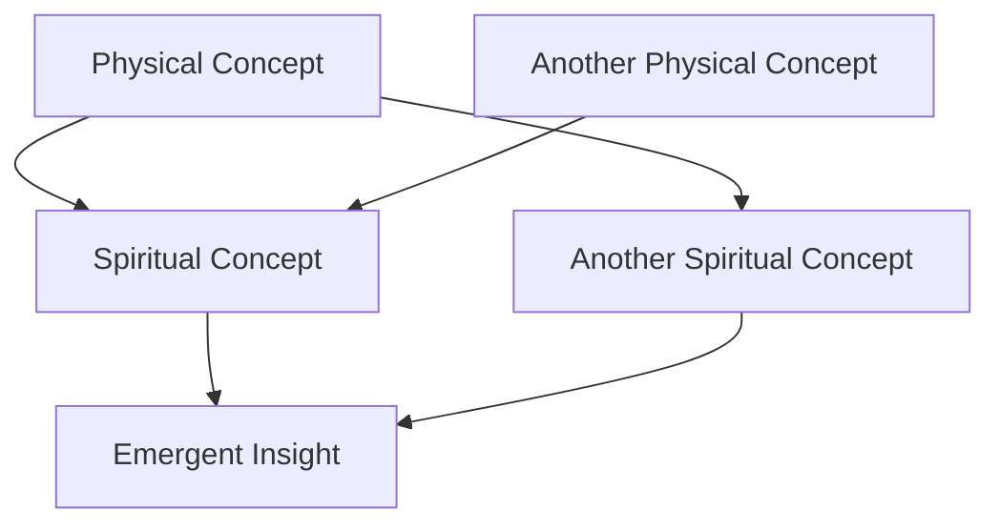
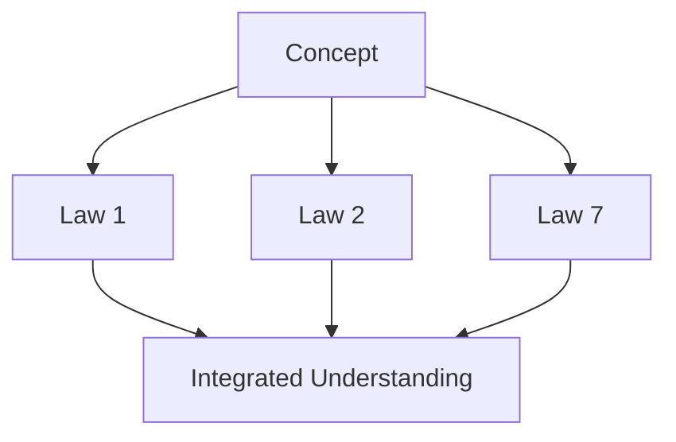

---
meta_tags:
- notes
- summary
- truth
- choice
- experiment
- guidance
- quantum
- community
- sin
- law
- final
- light
- network
- energy
- class
- entanglement
- outline
- story
- trinity
- transition
- master
- grace
- framework
- unity
- vine
summary: '# 📋 MASTER TEMPLATE: QUANTUM-SPIRITUAL LAWS FRAMEWORK --- --- ###### 🔍 **Searchable
  Keywords** #faith-physics #spiritual-struggle #divine-lift #gravitational-pull #Law1
  #SinGravity'
---

#  MASTER TEMPLATE: QUANTUM-SPIRITUAL LAWS FRAMEWORK

---


---

######  **Searchable Keywords**

#faith-physics #spiritual-struggle #divine-lift #gravitational-pull #Law1 #SinGravity

---

aliases: ["Gravity, Sin, and the Struggle to Rise", "Spiritual Gravity", "Law 1"] tags: ** Spiritual (Broad):** #spiritual-struggle #sin #grace #redemption ** Physics (Broad):** #universal-gravitation #newtonian-physics #einsteinian-physics **️ Spiritual (Technical):** #sin-gravity #spiritual-inertia #theology-of-fall **️ Physics (Technical):** #gravitational-force #escape-velocity #spacetime-curvature

---

##  Navigation

	  Law 1
	   Law 2
		law 3 
		Law 4
		Law 5
		Law 6
		law 7 
		Law 8
		Law 9
		law 10 


> **"What goes up must come down-unless a greater force lifts it higher."**
> -  **Interdimensional Knowledge Mapping**  
> _Click to expand_
> 
> > The First Law of Universal Gravitation reveals the fundamental principle of attraction that operates across physical, emotional, and spiritual domains. It demonstrates how the same mathematical patterns of attraction manifest from quantum particles to cosmic bodies, and from physical gravity to spiritual connection.
> -  **Dimensional Classification**  
> _Click to expand_
> 
> > **Primary Domain:** Science, Theology  
> > **Secondary Domains:** Physics, Spirituality, Mathematics, Philosophy
> -  **Conceptual Taxonomy**  
> _Click to expand_
> 
> > **Theoretical Framework:** Newtonian Gravity, Quantum Mechanics, Spiritual Dynamics  
> > **Epistemological Lens:** Comparative, Phenomenological, Interdisciplinary
> -  **Unique Identification**  
> _Click to expand_
> 
> > **Compression Code:** GRAVITY-SIN-11  
> > **Ontological Prefix:** PHY-THEO-01
> -  **Core Focus**  
> _Click to expand_
> 
> > **Conceptual Nucleus:** Gravity, Sin's Pull, Escape Velocity  
> > **Metaphysical Resonance:** Grace as Counterforce, Divine Attraction
> -  **Conceptual Ecosystem**  
> _Click to expand_
> 
> > **Interdisciplinary Connections:** [[Grace as Force]], [[Spiritual Gravity]], [[Loose MD/Escape Velocity]], [[Quantum Entanglement]]  
> > **Dialectical Tensions:** Works vs. Grace, Freedom vs. Predestination, Physical vs. Spiritual Attraction
> -  **Transformative Potential**  
> _Click to expand_
> 
> > **Paradigm Shift Indicator:** High (Reframes understanding of spiritual attraction and divine intervention)  
> > **Integrative Capacity:** Bridges physical attraction with spiritual dynamics, provides mathematical language for metaphysical experience
> -  **Epistemological Markers**  
> _Click to expand_
> 
> > **Empirical Grounding:** Newton's Law of Universal Gravitation, Quantum Mechanics, Observable Spiritual Patterns  
> > **Transcendent Insight:** Grace as Counter-Gravitational Force, Christ as Ultimate Gravitational Constant

---


#  MASTER TEMPLATE SET for Obsidian Vault

These are your reusable module templates for every law (`[lawname]` = gravity, unity, entropy, etc.).

---


## ️ story.[lawname]  
### *[Insert Story Title Here]*  
> _Narrative Arc: One-line summary of the story's emotional or symbolic tie-in to the law._

---

[Write narrative scene here. Use Elijah or another symbolic figure. Use setting, emotion, and inner tension. Keep it visceral.]

---

> "Insert 1-2 line poetic or punchy takeaway."

---

		##  fastfacts.[lawname]  
> _Essential Story Insights_

- [Punchy reflection that echoes the law's theme through the story]
- [What the character experienced physically mirrors the law spiritually]
- [Short moral/thematic closure]


---

##  core.[lawname]  
> _Definition: A one-paragraph snapshot that captures the essence of this Law in poetic, practical, and scientific language._

---

[Write concise but rich summary of the law - enough for someone to "get it" in one read.]

---

		##  fastfacts.[lawname]  
> _Essence Recap_

- [This law = this spiritual parallel]
- [Summarizes scope or purpose]
- [Where it fits in the arc of the 10 Laws]


---

## ️ theology.[lawname]  
> _Theological Metaphor: What Scripture, doctrine, or spiritual tradition reveals about this law's counterpart in the soul._

---

[Explore sin, grace, covenant, gospel - how the law reveals divine nature.]

---

		##  fastfacts.[lawname]  
> _Theological Reflections_

- [Relevant verse reframed scientifically]
- [How this concept appears across biblical narrative]
- [Insight into God's character or redemptive arc]


---

##  science.[lawname]  
> _Scientific Foundations: What does physics or cosmology say about this law? Lay it out clearly but awe-inspiringly._

---

[Explain core concept (e.g., entropy, gravity, quantum mechanics) with clarity and reverence.]

---

		##  fastfacts.[lawname]  
> _Physics Breakdown_

- [Basic summary of the scientific principle]
- [A jaw-dropping stat or property]
- [Why it matters / What it governs]


---

##  integration.[lawname]  
> _Convergence: How the science and theology of this law map onto each other._

---

[Show the metaphor isn't just poetic - it's structurally resonant.]

---

##  fastfacts.[lawname]  
> _Science ↔ Spirit Echoes_

- [Parallel 1: Force ↔ Faith]
- [Parallel 2: Equation ↔ Redemption]
- [Theological insight hidden inside physical truth]

---

##  narrative.[lawname]  
### *[Insert Episode Title]*  
> _Ongoing character journey arc - told through scenes, symbol, and spiritual/physical transformation across the laws._

---

[Write the chapter/episode of your core character's arc here.  
This connects emotionally to the law's theme, but as part of a larger mythos.]

[You can include flashbacks, future echoes, symbolic moments, dreams, cosmic settings.]

---

> "Insert a final line with punch, symbolism, or mystery."


---

##  math.[lawname]  
> _Mathematical Modeling: Represent the law's dynamics symbolically. Use metaphoric equations._

---

[Include any formulas, spiritual math, or simplified equations from physics that carry metaphorical weight.]

---

##  fastfacts.[lawname]  
> _Equation Echoes_

- [Break down equation and explain it symbolically]
- [Highlight constants, variables, and analogies]


---
##  philosophy.[lawname]  
> _Philosophical Implications: What this law reveals about reality, truth, morality, being, time, or knowledge._

---

[Reference thinkers, wrestle with metaphysics, ask unanswerables.]

---

##  fastfacts.[lawname]  
> _Deep Thinkers' Takeaways_

- [Paradox or tension]
- [Ontological/moral insight]
- [Connection to bigger questions]


---
##  psychology.[lawname]  
> _Behavioral Mirror: How this law maps to human thought, emotion, identity, or trauma._

---

[Reference habit loops, resistance, shame, hope, formation.]

---

##  fastfacts.[lawname]  
> _Soul-Level Psychology_

- [How this law plays out in the mind]
- [Resonance with healing or breakdown]
- [Insight into transformation]


---

##  application.[lawname]  
> _Practical Application: Habits, disciplines, or choices that allow the law's insight to shape daily life._

---

[Frame this like a life-hack or spiritual practice manual.]

---

##  fastfacts.[lawname]  
> _Live This Law_

- [Simple ways to resist, align, or channel it]
- [Spiritual strategy meets habit loop]


---
## ️ overcoming.[lawname]  
> _Tactical Grace: How we overcome the downside or resistance of this law with grace, community, or surrender._

---

[Frame this as part spiritual warfare, part divine assistance.]

---

##  fastfacts.[lawname]  
> _Strategies for Breakthrough_

- [What's resisting you?]
- [What's lifting you?]
- [What grace makes this law redemptive?]


---

##  visuals.[lawname]  
> _Object Lessons & Metaphors: Ways to visualize this law - sketches, analogies, mental models._

---

[Include diagrams, image prompts, or metaphor setups.]

---

##  fastfacts.[lawname]  
> _Visual Parallels_

- [Rocket, well, particle, map, flame, mirror, etc.]
- [Story-enhancing visuals]

---
##  reflection.[lawname]  
> _Reflective Questions: Guide the reader into self-awareness and personal application._

---

[Pose 3-5 questions to help someone internalize the law.]

---

##  fastfacts.[lawname]  
> _Soul Search Prompts_

- [Where is this law at work in your life?]
- [What are you resisting or surrendering to?]


---

##  deepdive.[lawname]  
> _Advanced Explorations: Theology, physics, or metaphysics extended further for scholars or seekers._

---

[Connect to historical thinkers, link obscure theories, or explore niche metaphors.]

---

##  fastfacts.[lawname]  
> _Bonus Brain Fuel_

- [Quote, concept, or paradox worth chewing on]
- [Idea to revisit later]


---

##  intro.[lawname]  
### *[Insert Law Title/Subheading]*  
> _One-paragraph welcome to the law. Frame the scientific awe and the spiritual mirror._

---

[Write your dramatic opening here - poetic, scriptural, mythic, or cinematic. This sets the atmosphere.]

[Explain the cosmic law in physical terms.  
Then pivot into the spiritual metaphor it embodies.]

[Drop 1-2 rhetorical questions to invite curiosity.  
End with: "Welcome to Law X."]


---
##  intro.gravity  
### *Universal Gravitation → Sin's Pull: The Inescapable Reality*  
> _Where physical attraction and spiritual descent begin their mirrored dance._

---

Before light. Before atoms. Before orbit or order - there was pull.  
The downward insistence written into spacetime.  
The invisible architect of stars, tides, and temptation.

This is Gravity.  
This is Sin.  
And neither asks your permission to pull you closer.

What does it take to rise?

Welcome to Law 1.


---


---

With that, your full **Law Module Framework** now includes:

| Type         | Category            | Emoji | Purpose                          |
| ------------ | ------------------- | ----- | -------------------------------- |
| Introduction | `intro.[law]`       |      | Tone-setting welcome to the Law  |
| Story        | `story.[law]`       | ️    | Parable-style scene or symbol    |
| Narrative    | `narrative.[law]`   |     | Character-driven mythic arc      |
| Core Concept | `core.[law]`        |     | One-paragraph essence            |
| Theology     | `theology.[law]`    | ️    | Scriptural + doctrinal framing   |
| Science      | `science.[law]`     |     | Physical law explained           |
| Integration  | `integration.[law]` |     | Spiritual ↔ Scientific bridge    |
| Math         | `math.[law]`        |     | Equations + symbolism            |
| Philosophy   | `philosophy.[law]`  |     | Metaphysical implications        |
| Psychology   | `psychology.[law]`  |     | Human mind, identity, trauma     |
| Application  | `application.[law]` |     | Habits, disciplines              |
| Overcoming   | `overcoming.[law]`  | ️   | Resistance + redemptive strategy |
| Visuals      | `visuals.[law]`     |     | Metaphors, images                |
| Reflection   | `reflection.[law]`  |     | Self-examining questions         |
| Deep Dive    | `deepdive.[law]`    |     | Academic or advanced ideas       |


aliases: ["Gravity, Sin, and the Struggle to Rise"]
tags:  
** Spiritual (Broad):** #spiritual-struggle  
** Physics (Broad):** #universal-gravitation  
**️ Spiritual (Technical):** #sin-gravity  
**️ Physics (Technical):** #gravitational-force

######  **Searchable Keywords**

#faith-physics #spiritual-struggle #divine-lift #gravitational-pull

created: 2025-03-01  
related: [[Claude Laws/00_INBOX_FROM_DAVID/Law 2]], [[Escape Velocity & Redemption]], [[Trinity/Master_Equation/Master Equation]]
---

#  **Gravity, Sin, and the Struggle to Rise**

##  **Metadata & Core Concepts**  
> -  **Metadata & Core Concepts**  
> _Click to expand_  
>  
> > **Just as gravity pulls objects downward, sin pulls humanity away from divine purpose.**  
> > This law reveals how **Newton's Law of Universal Gravitation mirrors Sin's Binding Force.**
> -  **Where This Fits In**  
> _Click to expand_  
>  
> > **Primary Domain:** Science, Theology  
> > **Secondary Domains:** Physics, Spirituality, Cosmology, Ethics
> -  **Core Concepts at a Glance**  
> _Click to expand_  
>  
> > **Theoretical Framework:** Newton's Laws of Motion & Gravitation  
> > **Epistemological Lens:** Comparative, Phenomenological, Unified Theory  
> -  **Key Identifiers & Themes**  
> _Click to expand_  
>  
> > **Compression Code:** GRAVITY-SIN-1  
> > **Ontological Prefix:** PHY-THEO-1
> -  **What This Law Teaches**  
> _Click to expand_  
>  
> > **Conceptual Nucleus:** Gravity, Sin, Redemption  
> > **Metaphysical Resonance:** The struggle of free will against the downward pull of corruption  
> -  **How It Connects to Everything Else**  
> _Click to expand_  
>  
> > **Interdisciplinary Connections:** [[ZZZ/Law 2]], [[1 Faith with Physics/10 Laws/10 Laws/Law 10 Folder  All Together + The Unified Quantum Framework/Master Equation]], [[Escape Velocity & Redemption]]  
> > **Dialectical Tensions:** Free Will vs. Predestination, Sin vs. Salvation  
> -  **How This Changes Our Perspective**  
> _Click to expand_  
>  
> > **Paradigm Shift Indicator:** High  
> > **Integrative Capacity:** Connects physics, theology, and morality into a cohesive framework  
> -  **How Do We Know This Is True?**  
> _Click to expand_  
>  
> > **Empirical Grounding:** Newton's Law of Universal Gravitation  
> > **Transcendent Insight:** Humanity's constant struggle against the pull of sin and the need for divine intervention  


This comprehensive template provides both structural guidance and content direction for each Law in your framework. Use this as your master reference when creating and organizing content in Obsidian.

---

## ️ FOLDER STRUCTURE FOR EACH LAW

```
 Law X - [Core Title]
   Law X: [Title] - Overview.md         (Main landing page for this Law)
   Law X: [Title] - The World.md        (Context section)
   Law X: [Title] - Core Concept.md     (Definition section)
   Law X: [Title] - Spiritual Mapping.md (Theological connections)
   Law X: [Title] - Physics Foundations.md (Scientific principles)
   Law X: [Title] - Faith Integration.md (Practical applications)
   Law X: [Title] - Experiments.md      (Visual metaphors & examples)
   Law X: [Title] - Fast Facts.md       (Key takeaways)
   Deep Dives                           (Optional folder for upsell content)
     Law X: [Title] - Mathematical Analysis.md
     Law X: [Title] - Theological Framework.md
     Law X: [Title] - Quantum Implications.md
```

---

##  STANDARD FILE STRUCTURE FOR MAIN PAGE

```markdown
#  Law X: [Core Title]

> _"[Powerful quote that encapsulates this Law's essence]"_

##  Navigation
 [[Law 1: The Pull of Sin]]  
 [[Law 2: The Grace Counterforce]]  
...  
 [[Law 10: Final Integration]]  
 [[Glossary of Spiritual Physics]]  
 [[The 10 Laws Overview]]  

##  Core Concept - Quick Overview

[1-2 paragraph summary of what this Law represents]

- Key points highlighted with bullet points
- Essential principles emphasized
- Core metaphor introduced

##  What You'll Find in This Law:

| Section | Focus | Key Question |
|---------|-------|--------------|
|  **The World** | Historical & scientific context | How does this appear in reality? |
|  **Core Concept** | Fundamental definition | What is this Law? |
| ️ **Spiritual Mapping** | Biblical & theological connections | How does this reflect God's nature? |
|  **Physics Foundations** | Scientific principles | What physical laws mirror this? |
| ️ **Faith Integration** | Practical application | How does this transform daily life? |
|  **Experiments & Visuals** | Metaphors & demonstrations | How can we visualize this? |
|  **Fast Facts** | Key takeaways | What are the essential insights? |

##  Connections to Other Laws

- **[[Law X-1]]**: How the previous Law flows into this one
- **[[Law X+1]]**: How this Law prepares for the next one
- **[[Law Y]]**: Unexpected connections to non-sequential Laws

##  Deep Dive Resources

> These advanced resources explore the mathematical and theological dimensions more deeply.

-  [[Law X: Mathematical Analysis]] - Equations, proofs, and technical framework
- ️ [[Law X: Theological Framework]] - Advanced spiritual implications 
- ️ [[Law X: Quantum Implications]] - Higher-level physics connections

##  Tags

#LawX #[key-concept] #[scientific-domain] #[theological-theme]
```

---

##  CONTENT GUIDANCE FOR EACH SECTION

###  The World - Context Section

**Purpose:** Establish how this principle appears in reality, history, science, or everyday experience.

**Content Direction:**

- **Opening Hook:** Start with an observation, question, or provocative statement
- **Historical Context:** Brief overview of how this concept has been understood through history
- **Scientific Relevance:** How modern science observes or measures this principle
- **Cultural Impact:** How this principle appears in culture, often unrecognized
- **Personal Connection:** "You've experienced this when..." moment to create relevance

**Structural Notes:**

- Use storytelling elements here to engage emotionally before the technical content
- Include 1-2 compelling examples or case studies
- End with a transition that bridges to the Core Concept section

**Example Format:**

```markdown
#  The World - [Law Title]

[Opening hook that poses a question or makes a striking observation]

## Historical Thread
[How this concept has evolved through history]

## Scientific Echoes
[How modern science has discovered or measured this principle]

## Hidden in Plain Sight
[How we experience this in everyday life, often without recognizing it]

> "Powerful quote that captures the essence of this principle in the world"

[Transition sentence that bridges to Core Concept]
```

###  Core Concept - Definition Section

**Purpose:** Clearly define the Law in simple yet profound terms.

**Content Direction:**

- **Essential Definition:** Crystal clear statement of what this Law is
- **Three-Part Breakdown:** Divide the concept into 3 key components or perspectives
- **Symbolic Representation:** How this Law can be visualized or symbolized
- **First Principles:** The foundational truths this Law rests upon
- **Metaphorical Framework:** The primary metaphor that makes this concept accessible

**Structural Notes:**

- Keep language precise but accessible
- Use bold text for key definitions
- Include a simple conceptual diagram if possible
- This section should be quotable and memorable

**Example Format:**

```markdown
#  Core Concept - [Law Title]

[One-sentence definition that captures the essence]

## Three Essential Dimensions
1. **[First Component]**: [Explanation with accessible language]
2. **[Second Component]**: [Explanation with accessible language]
3. **[Third Component]**: [Explanation with accessible language]

## Symbolic Representation
[How this Law can be visualized or symbolized]


## Core Metaphor
[The primary metaphor that makes this concept accessible]

[Closing statement that prepares for Spiritual Mapping]
```

### ️ Spiritual Mapping - Theological Connections

**Purpose:** Connect this Law to biblical insight, spiritual metaphors, and theological truth.

**Content Direction:**

- **Scriptural Foundation:** Key biblical passages that illuminate this principle
- **Theological Framework:** How this connects to broader theological concepts
- **Divine Attributes:** What this reveals about God's nature
- **Spiritual Parallels:** How spiritual realities mirror this principle
- **Redemptive Narrative:** How this fits into the larger story of salvation

**Structural Notes:**

- Quote scripture directly but keep interpretation accessible
- Use a table to map physical/scientific concepts to spiritual parallels
- Include insights from respected theological voices
- This section bridges the scientific and the spiritual

**Example Format:**

```markdown
# ️ Spiritual Mapping - [Law Title]

[Opening statement about how this Law reveals spiritual truth]

## Scriptural Echoes
> "[Biblical quote]" - [Reference]

[Explanation of how scripture illuminates this principle]

## Mapping Physical to Spiritual
| Physical Reality | Spiritual Truth |
|------------------|-----------------|
| [Scientific concept] | [Theological parallel] |
| [Scientific concept] | [Theological parallel] |
| [Scientific concept] | [Theological parallel] |

## Divine Reflection
[How this Law reflects God's nature or character]

## Redemptive Narrative
[How this concept fits into the larger story of salvation]

[Closing thought that bridges to Physics Foundations]
```

###  Physics Foundations - Scientific Principles

**Purpose:** Explain the actual physics or science that underlies this spiritual principle.

**Content Direction:**

- **Scientific Definition:** Clear explanation of the relevant scientific law or principle
- **Key Equations:** Simple presentation of mathematical relationships (if applicable)
- **Real-World Examples:** How this principle manifests in observable reality
- **Historical Discovery:** Brief narrative of how this was discovered or formulated
- **Current Understanding:** Where science stands today regarding this principle

**Structural Notes:**

- Keep scientific explanations accessible but accurate
- Use analogies to make complex concepts relatable
- Include simple diagrams or visualizations
- Optional deeper mathematical section for those interested

**Example Format:**

````markdown
#  Physics Foundations - [Law Title]

[Opening statement about the scientific principle]

## The Science Simplified
[Accessible explanation of the core scientific concept]

## Mathematical Expression
[Simple presentation of the key equation or relationship]
```math
[Equation]
````

## Real-World Manifestation

[How this principle appears in observable reality]

## Scientific Journey

[Brief narrative of discovery or formulation]

[Closing thought that bridges to Faith Integration]

> **For those interested in deeper mathematics:** [Optional section with more technical details - potential "upsell" content]

````

### ️ Faith Integration - Practical Application

**Purpose:** Show how this Law applies to daily spiritual life and decision-making.

**Content Direction:**
- **Personal Transformation:** How understanding this principle changes perspective
- **Practical Steps:** Specific actions or practices that apply this principle
- **Warning Signs:** How to recognize when you're misaligned with this Law
- **Growth Metrics:** How to measure progress in this area
- **Community Dimension:** How this principle works in relationships and community

**Structural Notes:**
- Use second-person "you" language to create personal relevance
- Include specific, actionable examples
- Create a balance between individual and community applications
- This section should be highly practical and immediately applicable

**Example Format:**
```markdown
# ️ Faith Integration - [Law Title]

[Opening statement about practical significance]

## Personal Transformation
[How understanding this principle changes perspective]

## Recognizing Alignment
- **Signs of Alignment**: [Specific indicators of alignment with this Law]
- **Warning Signs**: [Specific indicators of misalignment with this Law]

## Steps Toward Alignment
1. [Specific practice or action]
2. [Specific practice or action]
3. [Specific practice or action]

## Community Dimension
[How this principle works in relationships and community]

[Closing thought that bridges to Experiments & Visuals]
````

###  Experiments & Visuals - Metaphors & Demonstrations

**Purpose:** Provide visual metaphors, thought experiments, and demonstrations that make the concept tangible.

**Content Direction:**

- **Thought Experiment:** Hypothetical scenario that illuminates the principle
- **Visual Metaphor:** Clear visual representation of the abstract concept
- **Practical Demonstration:** Simple experiment or activity that demonstrates the principle
- **Conceptual Diagram:** Structured visual of how components relate
- **Narrative Illustration:** Story or parable that embodies the principle

**Structural Notes:**

- Use a mix of textual and visual elements
- Keep experiments and demonstrations simple and accessible
- Create elements that are shareable and memorable
- This section should engage imagination and creativity

**Example Format:**

```markdown
#  Experiments & Visuals - [Law Title]

[Opening statement about visualizing or experiencing this principle]

## Thought Experiment
[Hypothetical scenario that illuminates the principle]

## Visual Metaphor

[Explanation of how this visual represents the concept]

## Try This at Home
[Simple experiment or activity that demonstrates the principle]

## Concept Mapping
[Structured visual of how components relate]

[Closing thought that bridges to Fast Facts]
```

###  Fast Facts - Key Takeaways

**Purpose:** Provide punchy, memorable, shareable insights that distill the essence of this Law.

**Content Direction:**

- **Core Truth Statement:** One-sentence summary of the entire Law
- **Parallel Structure:** Physical reality → Spiritual parallel
- **Numerical Pattern:** "3 Ways to...", "4 Signs of...", etc.
- **Cause-Effect Relationships:** How this principle creates predictable outcomes
- **Application Prompts:** Quick questions for personal reflection

**Structural Notes:**

- Use consistent visual formatting with checkmarks (️)
- Keep each point concise and memorable
- Create content that could stand alone as a social media post
- This section should be highly quotable and shareable

**Example Format:**

```markdown
#  Fast Facts - [Law Title]

️ [Physical principle] → [Spiritual parallel]
️ [Physical principle] → [Spiritual parallel]
️ [Physical principle] → [Spiritual parallel]
️ [Physical principle] → [Spiritual parallel]
️ [Physical principle] → [Spiritual parallel]

## Key Questions for Reflection
- [Question that prompts personal application]
- [Question that prompts personal application]
- [Question that prompts personal application]
```

---

##  DEEP DIVE CONTENT TEMPLATES (UPSELL CONTENT)

###  Mathematical Analysis

**Purpose:** Provide deeper mathematical exploration for those interested in the technical framework.

**Content Direction:**

- **Complete Equation Breakdown:** Detailed analysis of all components in the mathematical model
- **Variable Relationships:** How different elements interact mathematically
- **Edge Cases:** Mathematical behavior under extreme conditions
- **Integration with Master Equation:** How this Law connects to the complete framework
- **Predictive Models:** How mathematics can forecast outcomes in this domain

**Structural Notes:**

- This is advanced content for mathematically inclined readers
- Include proper mathematical notation and formalism
- Connect abstract mathematics to concrete applications
- This content can serve as an "upsell" for readers wanting greater depth

**Example Format:**

````markdown
#  Mathematical Analysis - [Law Title]

[Opening statement about mathematical significance]

## Complete Equation
```math
[Full mathematical expression]
````

## Component Breakdown

- **[Variable 1]**: [Definition and significance]
- **[Variable 2]**: [Definition and significance]
- **[Variable 3]**: [Definition and significance]

## Key Relationships

[How variables interact and influence outcomes]

## Integration with Master Equation

[How this component fits into the complete framework]

## Mathematical Predictions

[Testable outcomes based on mathematical relationships]

````

### ️ Theological Framework

**Purpose:** Explore deeper theological implications for those interested in spiritual foundations.

**Content Direction:**
- **Historical Theology:** How this concept has been understood throughout church history
- **Denominational Perspectives:** Different theological traditions' approaches to this concept
- **Systematic Connections:** How this fits with broader theological systems
- **Apologetic Value:** How this concept addresses common objections or questions
- **Spiritual Formation:** Deeper practices for integration into spiritual life

**Structural Notes:**
- This is advanced content for theologically inclined readers
- Balance academic rigor with practical spiritual value
- Include diverse theological perspectives where appropriate
- This content can serve as an "upsell" for readers wanting greater spiritual depth

**Example Format:**
```markdown
# ️ Theological Framework - [Law Title]

[Opening statement about theological significance]

## Historical Understanding
[How this concept has been understood throughout church history]

## Theological Perspectives
[Different approaches to this concept across traditions]

## Systematic Connections
[How this fits with broader theological systems]

## Apologetic Implications
[How this addresses common objections or questions]

## Formation Practices
[Deeper practices for integration into spiritual life]
````

### ️ Quantum Implications

**Purpose:** Explore higher-level physics connections for those interested in advanced scientific frameworks.

**Content Direction:**

- **Quantum Mechanics Connections:** How this principle relates to quantum phenomena
- **Information Theory Aspects:** Relationships to entropy, information preservation, etc.
- **Higher-Dimensional Models:** How extra dimensions might explain unusual properties
- **Experimental Evidence:** Current scientific research related to this principle
- **Theoretical Frontiers:** Cutting-edge physics theories that relate to this concept

**Structural Notes:**

- This is advanced content for scientifically inclined readers
- Balance theoretical exploration with empirical grounding
- Include references to relevant scientific literature
- This content can serve as an "upsell" for readers wanting greater scientific depth

**Example Format:**

```markdown
# ️ Quantum Implications - [Law Title]

[Opening statement about significance in advanced physics]

## Quantum Framework
[How this principle relates to quantum phenomena]

## Information Theory Perspective
[Relationships to entropy, information processing, etc.]

## Higher-Dimensional Properties
[How extra dimensions might explain unusual aspects]

## Current Research
[Recent scientific investigations related to this principle]

## Theoretical Horizons
[Emerging theories that may further illuminate this concept]
```

---

##  LAW-SPECIFIC CONTENT MAPPING

Here's how each of the 10 Laws maps to specific content themes and focuses:

### Law 1: Spiritual State (χ)

- **Core Metaphor:** Overall field/atmosphere
- **Scientific Domain:** Field theory
- **Key Scripture:** 2 Peter 3:18
- **Mathematical Focus:** The Master Equation as a whole
- **Practical Focus:** Measuring and monitoring spiritual condition

### Law 2: Grace Function

- **Core Metaphor:** Anti-gravity/lifting force
- **Scientific Domain:** Force counteraction
- **Key Scripture:** Romans 5:20
- **Mathematical Focus:** $G(R_p) = G_0 \cdot e^{(R_p/S)}$
- **Practical Focus:** Receiving and activating grace

### Law 3: Sin & Entropy

- **Core Metaphor:** Disorder/breakdown
- **Scientific Domain:** Thermodynamics
- **Key Scripture:** Romans 6:23
- **Mathematical Focus:** $E(t) = E_0e^{kt}$ and $S(t) = S_0e^{-\lambda R_p t}$
- **Practical Focus:** Recognizing and countering spiritual entropy

### Law 4: Quantum Choice Field

- **Core Metaphor:** Decision as reality-shaping
- **Scientific Domain:** Quantum mechanics
- **Key Scripture:** Joshua 24:15
- **Mathematical Focus:** $e^{-(Q \cdot C)}$
- **Practical Focus:** Making choices that align with divine order

### Law 5: Faith Response Function

- **Core Metaphor:** Amplification/catalyst
- **Scientific Domain:** Amplification systems
- **Key Scripture:** Matthew 17:20
- **Mathematical Focus:** $R(F) = 1 + \sum_{i=1}^{n} F_i e^{-d_i}$
- **Practical Focus:** Building faith that creates impact

### Law 6: Spiritual Utility Function

- **Core Metaphor:** Effectiveness/fruitfulness
- **Scientific Domain:** System optimization
- **Key Scripture:** 1 Corinthians 3:6
- **Mathematical Focus:** $U(S_s) = U_0 + \Delta U(S_s)$
- **Practical Focus:** Maximizing spiritual effectiveness

### Law 7: Spiritual Decay

- **Core Metaphor:** Breakdown over time
- **Scientific Domain:** Radioactive decay
- **Key Scripture:** Ephesians 5:15-16
- **Mathematical Focus:** $-\delta\chi$
- **Practical Focus:** Maintaining spiritual disciplines

### Law 8: Karma Function

- **Core Metaphor:** Ripple effects/echoes
- **Scientific Domain:** Cause-effect relationships
- **Key Scripture:** Galatians 6:7
- **Mathematical Focus:** $K(t) = \int_{0}^{t} S(\tau) e^{-\eta(t-\tau)} d\tau$
- **Practical Focus:** Understanding consequences of actions

### Law 9: Divine Mystery Factor

- **Core Metaphor:** Beyond comprehension
- **Scientific Domain:** Uncertainty principles
- **Key Scripture:** 1 Corinthians 15:54
- **Mathematical Focus:** $\Omega \cdot T(F,S,t)$
- **Practical Focus:** Embracing mystery in faith

### Law 10: Final Integration

- **Core Metaphor:** Complete system harmony
- **Scientific Domain:** Unified field theory
- **Key Scripture:** Revelation 21:5
- **Mathematical Focus:** The complete integrated framework
- **Practical Focus:** Living in holistic spiritual alignment

---
Let's create that additional section to include under the Deep Dive resources:

markdown

Copy

`###  Theoretical Foundations - Source Theories Integration **Purpose:** Document the scientific and theological theories that have been integrated into this Law. **Content Direction:** - **Source Theories**: Identify specific scientific/theological theories incorporated - **Integration Points**: How each theory connects to this specific Law - **Key Adaptations**: How the original theory was modified or expanded - **Original Sources**: References to foundational papers or thinkers - **Further Reading**: Links to more detailed explorations **Structural Notes:** - Organize by scientific domain (quantum mechanics, information theory, etc.) - Include brief explanations of why each theory was relevant - Link to deeper resources when available - This section documents your intellectual framework's foundations **Example Format:** ```markdown #  Theoretical Foundations - [Law Title] [Opening statement about theoretical grounding] ## Integrated Scientific Theories | Source Theory | Original Domain | Integration Point | Adaptation | |---------------|----------------|-------------------|------------| | [Theory Name] | [Field] | [How it connects to this Law] | [How you've extended it] | | [Theory Name] | [Field] | [How it connects to this Law] | [How you've extended it] | | [Theory Name] | [Field] | [How it connects to this Law] | [How you've extended it] | ## Theological Foundations | Theological Concept | Tradition | Integration Point | Adaptation | |---------------------|-----------|-------------------|------------| | [Concept] | [Tradition] | [How it connects to this Law] | [How you've extended it] | | [Concept] | [Tradition] | [How it connects to this Law] | [How you've extended it] | | [Concept] | [Tradition] | [How it connects to this Law] | [How you've extended it] | ## Key Papers and References -  [[Paper Title]] - Brief explanation of relevance -  [[Book or Source]] - Brief explanation of relevance -  [[Original Research]] - Brief explanation of relevance [Closing thought about the theoretical foundation]`

This section should be placed within the Deep Dives folder for each Law, alongside the Mathematical Analysis, Theological Framework, and Quantum Implications files. You could include it in your folder structure like this:

Copy

` Law X - [Core Title]    [Main files as previously outlined]   Deep Dives     Law X: [Title] - Mathematical Analysis.md     Law X: [Title] - Theological Framework.md     Law X: [Title] - Quantum Implications.md     Law X: [Title] - Theoretical Foundations.md`

This addition completes the intellectual framework by explicitly documenting the theoretical underpinnings of each Law, showing how you've integrated and extended existing scientific and theological concepts. It also creates natural opportunities for deeper exploration through linked content.
##  IMPLEMENTATION WORKFLOW

1. **Create folder structure** for all 10 Laws
2. **Build main overview pages** for each Law
3. **Develop core sections** for each Law
4. **Create cross-linking system** between related concepts
5. **Add deep dive content** for "upsell" material
6. **Implement navigation system** across all pages
7. **Build glossary and master reference** pages

---

##  VISUAL STYLING GUIDE

- **Use consistent emoji prefixes** for section types
- **Maintain table formats** for comparative information
- **Include concept diagrams** that follow a unified visual language
- **Create "Fast Facts" boxes** with standardized formatting
- **Use "note boxes"** for special insights or additional content
- **Implement consistent heading levels** for hierarchical organization

---
# Academy Folder Structure

## Core Files

### 1.  Academy/Meta
- `Research Framework.md` - Your overall methodology for connecting physics and spirituality
- `Hypothesis Registry.md` - Central list of all hypotheses being explored
- `Connection Patterns.md` - Recurring patterns you've noticed between physical and spiritual concepts

### 2.  Academy/Hypothesis Labs
- `H1 - Quantum Spirituality.md` - Exploring quantum physics principles in spiritual contexts
- `H2 - Information Theology.md` - Information theory's application to divine communication
- `H3 - Cosmological Structure & Divine Order.md` - Universe's structure reflects spiritual principles
- `H4 - Nuclear Forces as Spiritual Binding.md` - Strong/weak nuclear forces as metaphors for spiritual connection
- `H5 - Spiritual Relativity.md` - Relativistic frameworks applied to spiritual experiences

### 3.  Academy/Connection Maps
- `Physics-Theology Map.md` - Visual mapping of connections between physics concepts and theological principles
- `Mathematical-Spiritual Map.md` - Connections between mathematical principles and spiritual concepts
- `Energy-Grace Map.md` - Mapping energy concepts to spiritual grace concepts
- `Quantum-Consciousness Map.md` - Connections between quantum phenomena and consciousness/spirit

### 4.  Academy/Research
- `Literature Review.md` - Analysis of existing work connecting physics and spirituality
- `Experimental Framework.md` - How spiritual hypotheses might be tested/validated
- `Research Questions.md` - Central questions driving your exploration
- `Evidence Registry.md` - Catalog of supporting evidence for different connections

### 5.  Academy/Cross-Law Analysis
- `Law Interaction Matrix.md` - How your 10 laws interact with and support each other
- `Unifying Principles.md` - Core principles that appear across multiple laws
- `Contradiction Resolution.md` - Addressing apparent contradictions between laws
- `Meta-Law Hypothesis.md` - Exploring whether there's a single "meta-law" that generates all others

## Connection-Generating Templates

### Concept Bridge Template
```markdown
# Concept Bridge: [Physics Concept] ↔ [Spiritual Concept]

## Core Connection
- **Physical Principle**: [Explanation of physical principle]
- **Spiritual Parallel**: [Explanation of spiritual parallel]
- **Mathematical Expression**: [Formula if applicable]

## Connection Strength
- **Direct Evidence**: [Supporting evidence for direct connection]
- **Inferential Evidence**: [Indirect support for the connection]
- **Predictive Power**: [What this connection might predict or explain]

## Bidirectional Insights
- **Physics → Spirituality**: [What physics reveals about spirituality]
- **Spirituality → Physics**: [What spiritual concepts might reveal about physics]

## Related Laws
- Primary: [[Law X]]
- Secondary: [[Law Y]], [[Law Z]]

## Open Questions
- [Question 1]
- [Question 2]

## Research Directions
- [Potential research avenue 1]
- [Potential research avenue 2]
```

### Cross-Disciplinary Analysis Template
```markdown
# Cross-Disciplinary Analysis: [Topic]

## Disciplinary Perspectives
- **Physics**: [How physics understands this]
- **Theology**: [Theological perspective]
- **Philosophy**: [Philosophical angle]
- **Mathematics**: [Mathematical framework]

## Harmony Analysis
- **Areas of Agreement**: [Where disciplines align]
- **Apparent Contradictions**: [Where they seem to disagree]
- **Synthesis Opportunities**: [How to harmonize perspectives]

## Dimensional Analysis
- **Physical Dimension**: [Space-time analysis]
- **Informational Dimension**: [Information theory perspective]
- **Consciousness Dimension**: [How consciousness interacts]
- **Spiritual Dimension**: [Spiritual framework]

## Integration Model
- **Proposed Framework**: [Integrated understanding]
- **Mathematical Model**: [Formalization if possible]
- **Testable Elements**: [What could be validated]

## Connected Concepts
- [List of related concepts with links]
```

### Radical Hypothesis Template
```markdown
# Radical Hypothesis: [Title]

## The Wild Idea
- [Concise statement of unconventional hypothesis]

## Conventional Understanding
- [What current science/theology says]

## The Paradigm Shift
- [How this hypothesis changes our understanding]

## Potential Implications
- **For Physics**: [Implications]
- **For Theology**: [Implications]
- **For Consciousness**: [Implications]
- **For Humanity**: [Implications]

## Supporting Patterns
- [Pattern 1 with links to supporting concepts]
- [Pattern 2 with links to supporting concepts]

## Thought Experiments
- [Experiment 1 to consider this hypothesis]
- [Experiment 2 to consider this hypothesis]

## Integration with Laws
- [How this connects to your existing laws]
```

## Tag System for Academy Files

Use these tags for cross-referencing in your Academy files:

- `#hypothesis` - For speculative connections
- `#evidence` - For supporting evidence
- `#contradiction` - For noting conflicts to resolve
- `#pattern` - For recurring patterns
- `#quantum` - For quantum physics related concepts
- `#consciousness` - For consciousness related concepts
- `#information-theory` - For information theory concepts
- `#nuclear` - For nuclear physics concepts
- `#relativity` - For relativity concepts
- `#mathematics` - For mathematical models and frameworks
- `#experiment` - For testable elements
- `#metaphor` - For using concepts as metaphors
- `#direct-parallel` - For concepts with strong parallels
- `#creative-leap` - For particularly innovative connections
- `#cross-law` - For concepts spanning multiple laws

## Connection Tracking System

Create a central file `Connection_Registry.md` with this format:

```markdown
# Connection Registry

## Physics → Spirituality Connections
| Physics Concept | Spiritual Concept | Connection Strength | Primary Law | Notes |
|----------------|-------------------|---------------------|-------------|-------|
| [Concept 1] | [Concept 2] | Strong/Medium/Weak | [[Law X]] | [Brief note] |
| [Concept 3] | [Concept 4] | Strong/Medium/Weak | [[Law Y]] | [Brief note] |

## Spirituality → Physics Insights
| Spiritual Concept | Physics Insight | Validation Status | Primary Law | Notes |
|-------------------|----------------|-------------------|-------------|-------|
| [Concept 1] | [Insight 1] | Validated/Hypothetical | [[Law Z]] | [Brief note] |
```

## Visualization Framework

Use these Mermaid diagrams to visualize connections:

### Concept Network
```
%%
%%  Use this in your files to map concept relationships
%%

```

### Law Integration Map
```
%%
%%  Use this to show how a concept integrates across laws
%%

```
#Law-2Folder
##strong-nuclear-force
##quark-binding
##nuclear-binding-energy
##gluons
##quantum-entanglement
##covalent-bonding
##atomic-cohesion
##nuclear-stability
##binding-energy-formula
##quantum-field-theory
##unified-force-model
##divine-unity
##faith-cohesion
##spiritual-binding
##covenantal-strength
##spiritual-communion
##theological-unity
##divine-love-exchange
##unbreakable-covenant
##redemptive-connection
##spiritual-resonance
##faith-community-bond
##faith-physics
##divine-bond
##theological-chromodynamics
##spiritual-cohesion
##prayer-quantum-link
##gluon-theology
##quantum-faith-mechanics
##covenant-physics
##spiritual-nuclear-stability
##nonlocal-spirituality
##binding-force-of-love
##logos
##biblical-covenant
##Pauline-theology
##unbreakable-faith
##body-of-Christ
##Ephesians-unity
##Romans-bond-of-love
##spiritual-symphony
##Gods-binding-force
##John17-divine-unity
##Master-Equation
##Reality-Laws
##Universal-Cohesion
##Faith-Structural-Integrity
##Truth-in-Physics
##Christ-as-the-Binding-Agent
##Trinity-Divine-Bond
##Metaphysical-Gravity
##Heavenly-Physics
##Resonant-Truth
This comprehensive template provides both structural guidance and content direction for implementing the 10 Laws framework in Obsidian. Adjust and customize as needed while maintaining the core organizational principles.


