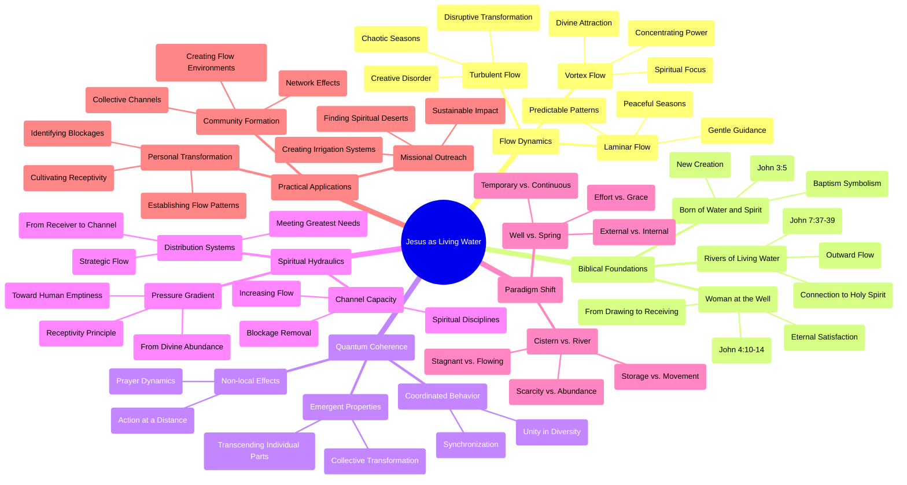

# Jesus as Living Water - Mind Map

```mermaid
mindmap
  root((Jesus as Living Water))
    (Flow Dynamics)
      (Laminar Flow)
        (Gentle Guidance)
        (Peaceful Seasons)
        (Predictable Patterns)
      (Turbulent Flow)
        (Disruptive Transformation)
        (Chaotic Seasons)
        (Creative Disorder)
      (Vortex Flow)
        (Concentrating Power)
        (Divine Attraction)
        (Spiritual Focus)
    (Biblical Foundations)
      (Woman at the Well)
        (John 4:10-14)
        (From Drawing to Receiving)
        (Eternal Satisfaction)
      (Rivers of Living Water)
        (John 7:37-39)
        (Connection to Holy Spirit)
        (Outward Flow)
      (Born of Water and Spirit)
        (John 3:5)
        (Baptism Symbolism)
        (New Creation)
    (Quantum Coherence)
      (Coordinated Behavior)
        (Unity in Diversity)
        (Synchronization)
      (Non-local Effects)
        (Action at a Distance)
        (Prayer Dynamics)
      (Emergent Properties)
        (Transcending Individual Parts)
        (Collective Transformation)
    (Spiritual Hydraulics)
      (Pressure Gradient)
        (From Divine Abundance)
        (Toward Human Emptiness)
        (Receptivity Principle)
      (Channel Capacity)
        (Blockage Removal)
        (Increasing Flow)
        (Spiritual Disciplines)
      (Distribution Systems)
        (From Receiver to Channel)
        (Strategic Flow)
        (Meeting Greatest Needs)
    (Paradigm Shift)
      (Well vs. Spring)
        (External vs. Internal)
        (Effort vs. Grace)
        (Temporary vs. Continuous)
      (Cistern vs. River)
        (Stagnant vs. Flowing)
        (Storage vs. Movement)
        (Scarcity vs. Abundance)
    (Practical Applications)
      (Personal Transformation)
        (Identifying Blockages)
        (Cultivating Receptivity)
        (Establishing Flow Patterns)
      (Community Formation)
        (Creating Flow Environments)
        (Network Effects)
        (Collective Channels)
      (Missional Outreach)
        (Finding Spiritual Deserts)
        (Creating Irrigation Systems)
        (Sustainable Impact)
```
